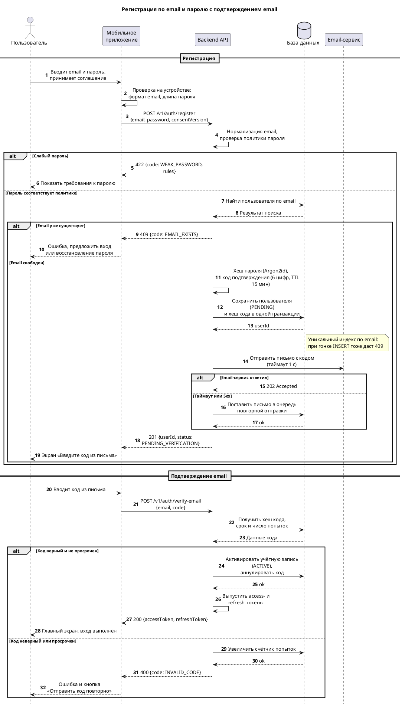

# Тестовое задание №2. Проектирование: регистрация и аутентификация в мобильном приложении

**Объект:** мобильное приложение интернет-магазина (iOS и Android).
**Охват:** регистрация по email и паролю, вход через Google и Apple, восстановление пароля. Детально проработана регистрация.

## Состав материалов

| Файл                         | Содержимое                                                                              | Формат   |
| ---------------------------- | --------------------------------------------------------------------------------------- | -------- |
| `bpmn_registration.drawio`   | BPMN-диаграмма регистрации: happy path, ошибки «слабый пароль» и «email уже существует» | draw.io  |
| `sequence_registration.puml` | UML Sequence: приложение → Backend API → база данных → Email-сервис                     | PlantUML |
| `Тестовое_задание_2.md`      | Этот документ: пояснения, требования, Acceptance Criteria                               | Markdown |

## Допущения

- Backend предоставляет REST/JSON API `/v1/auth/*`; пароли и коды подтверждения хранятся только в виде хешей.
- Email-сервис — внешний транзакционный провайдер, вызывается по HTTP API.
- Подтверждение email — 6-значный код со сроком действия 15 минут.
- Вход через Google и Apple выполняется по OIDC (Authorization Code + PKCE); собственные токены сервиса — access (короткоживущий) и refresh (с ротацией).

## 1. BPMN-диаграмма процесса регистрации

Файл: [bpmn_registration.drawio](https://github.com/Kiruxa/HomeWork/blob/main/bpmn_registration.drawio)(открывается в draw.io / diagrams.net).
![[bpmn_registration.drawio.png]]

**Дорожки:** Пользователь, Мобильное приложение, Backend API, База данных, Email-сервис.

**Happy path:**

1. Пользователь вводит email и пароль и принимает соглашение.
2. Приложение отправляет запрос регистрации в Backend API.
3. API проверяет формат email и политику пароля; шлюз «Пароль надёжный?» — да.
4. API находит учётную запись по email в базе данных; шлюз «Email уже существует?» — нет.
5. API хеширует пароль и создаёт код подтверждения.
6. База данных сохраняет учётную запись со статусом «не подтверждена».
7. Email-сервис отправляет письмо с кодом.
8. Подпроцесс «Подтверждение email» (ввод кода, проверка, активация, выдача токенов) завершается событием «Регистрация завершена».

**Обработка ошибок** (на диаграмме выделена оранжевым):

| Ошибка | Где обнаруживается | Ответ API | Реакция приложения |
|---|---|---|---|
| Слабый пароль | API, шлюз «Пароль надёжный?» | `422 WEAK_PASSWORD` и список нарушенных правил | Подсветить поле, показать требования, вернуть пользователя к форме (петля к вводу данных) |
| Email уже существует | API по результату поиска в БД, при гонке — по уникальному индексу | `409 EMAIL_EXISTS` | Предложить «Войти» или «Восстановить пароль», письмо не отправлять; процесс завершается событием «Регистрация отклонена» |

Примечания:

- Подпроцесс «Подтверждение email» свёрнут; его шаги показаны во второй части диаграммы последовательности.
- Если политика безопасности требует защиты от перечисления аккаунтов, ответ `409` заменяется нейтральным («Проверьте почту»), а владельцу адреса уходит письмо о попытке регистрации. Структура процесса при этом не меняется.

## 2. UML Sequence Diagram

Файл: [sequence_registration.puml](https://github.com/Kiruxa/HomeWork/blob/main/sequence_registration.puml). Участники: Пользователь, Мобильное приложение, Backend API, База данных, Email-сервис. Диаграмма состоит из двух частей: регистрация (с ветками ошибок) и подтверждение email.

![[UML_sequence.png]]

Отрисовать можно в расширении PlantUML для IDE, на plantuml.com или командой `plantuml sequence_registration.puml`.

Ключевые решения:

- Уникальный индекс по email закрывает гонку между проверкой и вставкой.
- Таймаут или 5xx Email-сервиса не отменяет регистрацию: письмо ставится в очередь повторной отправки (NFR-03).
- Токены выдаются только после подтверждения email.

## 3. Требования

### Функциональные требования

| ID | Требование |
|---|---|
| FR-01 | Система должна создавать учётную запись по email и паролю; email приводится к нижнему регистру без пробелов по краям и должен быть уникальным. |
| FR-02 | Система должна отклонять пароль короче 8 символов, из списка распространённых или скомпрометированных паролей либо совпадающий с email, возвращая код `WEAK_PASSWORD` и перечень нарушенных правил; проверка выполняется на устройстве и на сервере. |
| FR-03 | Система должна отправлять на email 6-значный одноразовый код (срок действия 15 минут, не более 5 попыток ввода), активировать учётную запись после ввода верного кода и разрешать повторную отправку не чаще одного раза в минуту. |
| FR-04 | Система должна аутентифицировать пользователя с подтверждённым email по email и паролю, выдавать access- и refresh-токены с ротацией refresh-токена и блокировать вход на 15 минут после 5 неудачных попыток подряд. |
| FR-05 | Система должна поддерживать вход и регистрацию через Google и Sign in with Apple (OIDC, Authorization Code + PKCE), проверять `id_token` на сервере (подпись, iss, aud, exp, nonce), создавать учётную запись при первом входе и связывать её с существующей только по подтверждённому email. |
| FR-06 | Система должна отправлять на email одноразовую ссылку или код для сброса пароля (срок действия 30 минут), не раскрывая, зарегистрирован ли адрес; после смены пароля отзывать все активные сессии и уведомлять пользователя письмом. |
| FR-07 | Система должна требовать принятия пользовательского соглашения и политики обработки персональных данных при регистрации и сохранять факт согласия, версию документов и время. |

### Нефункциональные требования

| ID | Категория | Требование |
|---|---|---|
| NFR-01 | Безопасность | Пароли хранятся только в виде хеша Argon2id с уникальной солью; весь трафик защищён TLS 1.2 и выше; на `/v1/auth/register`, `/v1/auth/login` и `/v1/auth/password/forgot` действует ограничение частоты — не более 5 запросов в минуту на пару IP и email. |
| NFR-02 | Производительность | p95 времени ответа `POST /v1/auth/register` — не более 800 мс, `POST /v1/auth/login` — не более 500 мс при нагрузке 200 запросов в секунду; вызов Email-сервиса ограничен таймаутом 1 с. |
| NFR-03 | Доступность | Доступность сервиса аутентификации — не менее 99,9% в месяц; недоступность Email-сервиса не прерывает регистрацию: письмо ставится в очередь и отправляется повторно (до 5 попыток в течение 30 минут). |

## 4. User Story и Acceptance Criteria

**US-01.** Как новый покупатель, я хочу зарегистрироваться в мобильном приложении по email и паролю, чтобы оформлять заказы и видеть историю покупок.

**AC-1. Успешная регистрация (happy path)**

- **Given** пользователь на экране регистрации, email `anna@example.com` не зарегистрирован, соглашение принято
- **When** он вводит email и пароль, соответствующий политике, и нажимает «Зарегистрироваться»
- **Then** создаётся учётная запись со статусом «не подтверждена», на email отправляется письмо с 6-значным кодом (срок действия 15 минут), приложение показывает экран «Введите код из письма», токены доступа не выдаются

**AC-2. Email уже существует**

- **Given** учётная запись с email `anna@example.com` уже существует
- **When** пользователь отправляет форму регистрации с этим email и корректным паролем
- **Then** новая учётная запись не создаётся, письмо не отправляется, приложение показывает «Этот email уже используется» с кнопками «Войти» и «Восстановить пароль», введённый email остаётся в форме

**AC-3. Слабый пароль**

- **Given** email `anna@example.com` свободен
- **When** пользователь вводит пароль «12345» (короче 8 символов) и отправляет форму
- **Then** API возвращает `422` с кодом `WEAK_PASSWORD`, учётная запись не создаётся, под полем пароля показаны нарушенные правила, введённый email остаётся в форме

**AC-4. Соглашение не принято**

- **Given** пользователь на экране регистрации, соглашение не принято
- **When** он вводит корректные email и пароль, не отметив чекбокс соглашения
- **Then** кнопка «Зарегистрироваться» неактивна и запрос регистрации не отправляется

**AC-5. Email-сервис недоступен**

- **Given** email свободен, а Email-сервис не отвечает (таймаут или 5xx)
- **When** пользователь отправляет корректную форму регистрации
- **Then** учётная запись создаётся (`201`), письмо ставится в очередь повторной отправки, приложение показывает экран ввода кода с кнопкой «Отправить код повторно»
